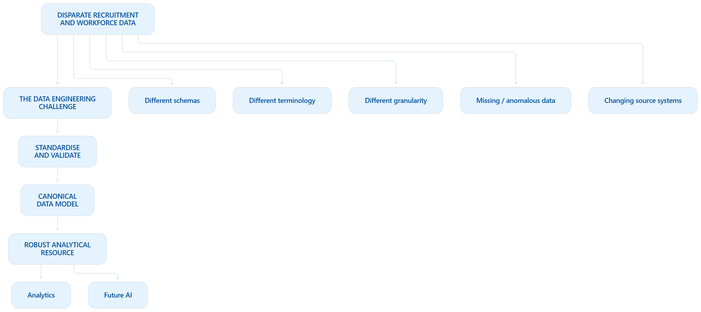

# Career Intelligence Platform

> **The purpose of the platform is to engineer disparate data sources into a standardised, robust resource for analytics.**

The **Career Intelligence Platform** is a modular data engineering platform for ingesting, profiling, transforming and analysing recruitment data.

The NHS Jobs dataset is the initial proof of concept. The platform is intentionally dataset-agnostic: the longer-term objective is to apply the same engineering approach to other recruitment and workforce data sources.

---

## Presentation Flow

1. [The Problem](#1-the-problem)
2. [The Data Engineering Approach](#2-the-data-engineering-approach)
3. [Proof of Concept — NHS Jobs](#3-proof-of-concept--nhs-jobs)
4. [The Canonical Data Model](#4-the-canonical-data-model)
5. [Data Quality — What Did the Engineering Reveal?](#5-data-quality--what-did-the-engineering-reveal)
6. [From Data Quality to Engineering Requirements](#6-from-data-quality-to-engineering-requirements)
7. [Extending Beyond NHS Jobs](#7-extending-beyond-nhs-jobs)
8. [AI-Augmented Data Integration](#8-ai-augmented-data-integration)
9. [Presentation Demonstration](#9-presentation-demonstration)
10. [What the Project Demonstrates](#10-what-the-project-demonstrates)
11. [Roadmap](#11-roadmap)
12. [Technical Documentation](#12-technical-documentation)

---

## 1. The Problem

Meaningful recruitment and labour-market analysis depends on the quality and consistency of the underlying data.

In practice, useful data can be:

- fragmented across different providers
- available at different levels of detail
- structured using different schemas
- inconsistent in terminology
- incomplete or anomalous
- affected by changes to source systems over time

Publicly available healthcare recruitment data also illustrates a practical problem: there is not necessarily one comprehensive, consistent dataset that can simply be downloaded and analysed.

The challenge therefore becomes:

> **How can limited, disparate and inconsistent data be engineered into a robust resource for analytics?**





> **[Presentation visual: replace this with a polished diagram]**


---

## 2. The Data Engineering Approach

The platform applies a repeatable data engineering process rather than building analysis directly on the source dataset.

```text
SOURCE DATA
     │
     ▼
  EXTRACT
     │
     ▼
  PROFILE
     │
     ▼
   CLEAN
     │
     ▼
 CANONICAL
  MAPPING
     │
     ▼
 VALIDATE
     │
     ▼
  MONGODB
     │
     ▼
 ANALYTICS
```

| Stage | Purpose |
|---|---|
| **Extract** | Ingest source data without coupling downstream processing to the source format |
| **Profile** | Understand structure, data types, missing values and potential quality issues |
| **Clean** | Apply source-specific data-quality and formatting rules |
| **Canonical Mapping** | Translate source fields into a common analytical model |
| **Validate** | Check that generated documents conform to the expected structure |
| **Store** | Persist validated documents independently of the original source schema |
| **Analyse** | Query the engineered dataset to test its usefulness and expose further quality issues |

> **The dataset is the proof of concept. The engineering process is the reusable asset.**


---

## 3. Proof of Concept — NHS Jobs

The current implementation uses a historical **NHS Jobs** dataset to validate the architecture.

The dataset provides individual recruitment records containing information such as:

- job title and reference
- employer and department
- salary and pay band
- contract and working pattern
- location
- publication and closing dates
- job description

The objective is not to claim that this represents the complete healthcare recruitment market. It provides a real dataset against which the platform can demonstrate:

```text
NHS Jobs dataset
       │
       ▼
   Extraction
       │
       ▼
    Profiling
       │
       ▼
     Cleaning
       │
       ▼
Canonical Mapping
       │
       ▼
    Validation
       │
       ▼
    MongoDB
       │
       ▼
    Analytics
```

> **[Presentation visual: raw source record → canonical document]**


---

## 4. The Canonical Data Model

The platform separates the source schema from the analytical model.

```text
                 Career Intelligence
                       Document
                          │
       ┌──────────┬───────┼───────┬──────────┐
       ▼          ▼       ▼       ▼          ▼
      Job    Organisation Employment Location Dates
                          │
                    ┌─────┴─────┐
                    ▼           ▼
                Metadata        AI
```

The current canonical document consists of:

- **job** – vacancy information, identifiers and descriptions
- **organisation** – employer and organisational information
- **employment** – contract, salary and working pattern
- **location** – geographic information
- **dates** – publication and closing dates
- **metadata** – dataset provenance and ingestion information
- **ai** – reserved for future AI enrichment, semantic metadata and embeddings

This stable model allows downstream analytics to remain independent of individual recruitment providers.

### Example

```json
{
  "job": {
    "id": "...",
    "title": "...",
    "description": "..."
  },
  "organisation": {
    "name": "...",
    "department": "..."
  },
  "employment": {
    "contract_type": "...",
    "working_pattern": "...",
    "salary": {
      "minimum": 0,
      "maximum": 0
    }
  },
  "location": {
    "town": "...",
    "postcode": "...",
    "latitude": 0,
    "longitude": 0
  },
  "dates": {
    "published": "...",
    "closing": "..."
  },
  "metadata": {
    "source": "NHS Jobs",
    "schema_version": 1
  },
  "ai": {
    "skills": [],
    "embedding": null
  }
}
```


---

## 5. Data Quality — What Did the Engineering Reveal?

Successful ingestion does not mean that the data is ready for analysis.

The engineering pipeline and query layer were used to investigate the quality and meaning of the resulting dataset.

### Salary quality

> **[Insert salary distribution chart here]**

The dataset contains missing salary values and a small number of extreme salary values.

### Salary anomalies

Examples include:

```text
4,908,600
8,195,110
7,791,000
```

These values are preserved rather than silently corrected.

> **[Insert salary outlier visualisation / table here]**

The investigation suggests that several values may result from source formatting problems. The platform identifies them as data-quality issues while retaining the original source values.

### Semantic and structural issues

| Observation | Engineering implication |
|---|---|
| Central advertising organisations appear prominently as employers | Employer/entity normalisation |
| Locations mix towns, hospitals and NHS sites | More granular canonical location model |
| Contract descriptions have multiple variants | Controlled contract categories |
| More than 3,000 records have missing salary information | Missing-data handling and quality reporting |

> **Data quality is not only about nulls and data types. It can also be about whether a value means what the analytical model assumes it means.**


---

## 6. From Data Quality to Engineering Requirements

The analytical findings feed back into the platform design.

| Observed problem | Engineering response |
|---|---|
| Missing values | Profiling, validation and explicit handling |
| Salary anomalies | Data-quality rules and anomaly analysis |
| Different terminology | Canonical mapping |
| Employer ambiguity | Future entity normalisation |
| Location granularity differences | Future canonical location model |
| Contract variations | Standardised categories while retaining source values |
| New/unknown schemas | Configuration-driven mapping and future AI assistance |

```text
          Source Data
               │
               ▼
        Data Engineering
               │
               ▼
            Analytics
               │
               ▼
        Discover Problems
               │
               ▼
       Improve the Model
               │
               └──────────────►
```


---

## 7. Extending Beyond NHS Jobs

The long-term purpose is not to create a single NHS Jobs database.

The platform should allow different sources to retain their own source-specific characteristics while mapping useful concepts into a common analytical model.

```text
                  CAREER INTELLIGENCE PLATFORM

        ┌────────────────┬────────────────┬────────────────┐
        ▼                ▼                ▼
     NHS Jobs       NHS Scotland       Future source
     adverts        workforce data      / API
        │                │                │
        ▼                ▼                ▼
  Source-specific extraction / cleaning / mapping
        │                │                │
        └────────────────┼────────────────┘
                         ▼
                 CANONICAL MODEL
                         │
                         ▼
                     MONGODB
                         │
                         ▼
                    ANALYTICS
```

The engineering challenge is to determine:

1. What information can be standardised?
2. What information must remain source-specific?
3. What information is missing?
4. What transformations are defensible?
5. How can provenance be preserved?

> **The objective is not to make different datasets identical. It is to make meaningful concepts comparable while preserving their source context.**


---

## 8. AI-Augmented Data Integration

A future objective is to reduce the manual effort required to integrate a new source.

The concept is to use semantic search and AI-assisted mapping to compare an unfamiliar schema with the platform's existing mapping knowledge.

### Example

A new provider supplies:

```text
job_title
employer_name
annual_pay
town
job_desc
contract
```

The platform already understands concepts such as:

```text
job.title
organisation.name
employment.salary
location.town
job.description
employment.contract_type
```

A future workflow could be:

```text
             NEW / UNKNOWN DATASET
                      │
                      ▼
                 PROFILE DATA
                      │
                      ▼
              IDENTIFY UNKNOWN
                  FIELD
                      │
                      ▼
             SEMANTIC SEARCH
                      │
          ┌───────────┴───────────┐
          ▼                       ▼
 Existing mappings          Similar fields /
   and examples              known concepts
          │                       │
          └───────────┬───────────┘
                      ▼
              AI-SUGGESTED MAPPING
                      │
                      ▼
                 VALIDATION
                      │
             ┌────────┴────────┐
             ▼                 ▼
           Accept          Review / reject
             │
             ▼
          CANONICAL MODEL
```

For example:

```text
"annual_pay"
      ↓
AI / semantic matching
      ↓
employment.salary
```

> **AI suggests mappings; the data engineering pipeline validates and controls them.**

This is a future/prototype concept, not part of the current NHS Jobs pipeline.


---

## 9. Presentation Demonstration

The demonstration focuses on the complete engineering path rather than individual functions.

### 1. Run the pipeline

```bash
python app.py
```

```text
Load
  ↓
Profile
  ↓
Clean
  ↓
Map
  ↓
Validate
  ↓
MongoDB
```

### 2. Inspect the resulting document

Show a real MongoDB document and the canonical structure:

```text
job
organisation
employment
location
dates
metadata
ai
```

### 3. Query the engineered data

Demonstrate one or two queries from the query layer:

- total jobs
- salary statistics
- top employers
- contract types
- salary outliers

### 4. Investigate a quality issue

Use the notebook/visualisation to demonstrate how the engineered data exposes a source-data problem.


---

## 10. What the Project Demonstrates

The project demonstrates that data engineering is not simply about moving data from A to B.

```text
          DISPARATE DATA
                │
                ▼
        ENGINEERING PROCESS
                │
       ┌────────┼────────┐
       ▼        ▼        ▼
    Quality   Schema   Structure
       │        │        │
       └────────┼────────┘
                ▼
       CANONICAL DATA MODEL
                │
                ▼
          RELIABLE ANALYTICS
                │
                ▼
        REUSABLE PLATFORM
```

The NHS Jobs dataset provides the proof of concept.

The reusable asset is the engineering process:

> **Profile → clean → standardise → validate → store → analyse**

The next challenge is applying that process to other disparate sources.


---

## 11. Roadmap

```text
PHASE 1
Prove the engineering pipeline
NHS Jobs
      │
      ▼
PHASE 2
Prove analytical value
Data quality + diagnostics
      │
      ▼
PHASE 3
Prove generalisation
Additional sources / APIs
      │
      ▼
PHASE 4
Reduce manual integration
AI-assisted mapping + enrichment
```

### Phase 1 — Core Data Platform ✅

- CSV data ingestion
- Dataset profiling and reporting
- Configurable data cleaning
- Canonical document mapping
- Document validation
- MongoDB document storage
- Repository layer
- Analytical query framework

### Phase 2 — Analytics & Engineering Findings

- Analytical query library
- Jupyter notebook demonstrations
- Salary analysis
- Employer and location analysis
- Data-quality investigation
- Engineering visualisations

### Phase 3 — Platform Expansion

- Multiple recruitment/workforce datasets
- API-based ingestion
- Configuration-driven schema mappings
- Automatic field alias recognition
- Expanded metadata model
- Databricks integration
- Cloud-based processing

### Phase 4 — AI & Intelligent Data Integration

- AI-assisted schema discovery
- Intelligent field mapping
- Skills extraction
- Duplicate vacancy detection
- Semantic search
- AI-assisted enrichment
- Labour-market intelligence services

---

## 12. Technical Documentation

### Architecture

The platform separates:

- Extraction
- Profiling
- Cleaning
- Canonical Mapping
- Validation
- Storage
- AI Enrichment

### Architecture principles

- Modular Python architecture
- Separation of ETL stages
- Separation of configuration, schema and mapping
- Stable canonical data model
- Source-specific processing where required
- Preservation of source provenance
- Validation before persistence
- Extensible architecture for future sources

### Component responsibilities

#### Data Extraction

The current implementation supports CSV ingestion, with the architecture designed to accommodate APIs and additional file formats in future.

#### Data Profiling

Generates summary statistics describing the incoming dataset, including missing values, duplicate records and data types. Profiling informs the cleaning process and provides transparency over data quality.

#### Data Cleaning

Applies configurable data-quality rules including duplicate removal, date conversion, column standardisation and salary normalisation. Cleaning behaviour is controlled through configuration to simplify future extension.

#### Canonical Mapping

Transforms heterogeneous recruitment datasets into a common Career Intelligence document model. This abstraction layer separates source-specific schemas from downstream analytics.

#### Validation

Verifies that each generated Career Intelligence document conforms to the canonical schema before persistence. Validation provides early detection of mapping errors and incomplete data.

#### MongoDB Repository

Stores validated Career Intelligence documents using a hierarchical document structure that represents recruitment data while remaining independent of the original source schema.

### Technology Stack

| Component | Technology | Current role |
|---|---|---|
| Python | Python | ETL and orchestration |
| MongoDB | MongoDB | Document storage |
| Pandas | Pandas | Data transformation and profiling |
| Jupyter | Jupyter | Analytical investigation |
| GitHub | Git/GitHub | Version control and documentation |
| Amazon S3 | AWS S3 | Planned data-lake integration |
| Databricks | Apache Spark | Planned scalable processing |
| EC2 | AWS EC2 | Optional/future hosting |

### Project Structure

```text
Career-Intelligence-Platform/
│
├── .env
├── .env.example
├── .gitignore
├── app.py
├── README.md
├── requirements.txt
├── assets/
├── data/
│   ├── exports/
│   ├── processed/
│   └── raw/
├── docs/
├── images/
├── notebooks/
├── src/
│   ├── analytics/
│   ├── clean/
│   ├── database/
│   ├── extract/
│   ├── load/
│   ├── models/
│   ├── profile/
│   ├── transform/
│   ├── utils/
│   └── validation/
└── tests/
```

### Installation & Setup

1. Clone the repository.
2. Create a Python virtual environment.
3. Install dependencies:

```bash
pip install -r requirements.txt
```

4. Configure environment variables:

```text
MONGO_URI=
MONGO_DATABASE=
MONGO_COLLECTION=
```

5. Place the NHS Jobs dataset in:

```text
data/raw/
```

6. Run:

```bash
python app.py
```

The platform will profile, clean, transform, validate and store Career Intelligence documents in MongoDB.

---

## Development Notes

### Salary outliers

The NHS Jobs dataset contains a small number of anomalous salary values. These values are preserved in the canonical dataset and identified by data-quality analytics rather than automatically corrected.

Examples:

```text
4908600 -> likely 49,086.00
8195110 -> likely 81,951.10
7791000 -> likely 77,910.00
```

The original values are preserved in MongoDB.

### Engineering Findings

- Salary outliers were detected in the source NHS dataset and isolated through data-quality queries.
- Employer analysis identified central advertising organisations, suggesting employer normalisation will improve future analytics.
- Location data contains a mixture of towns, hospitals and NHS sites, motivating a future canonical location model.
- Contract descriptions are semantically similar but inconsistently formatted, supporting a future enrichment layer.

---

## Long-Term Vision

The long-term objective is to create a reusable Career Intelligence Platform capable of integrating heterogeneous recruitment and workforce data into a common analytical model.

Rather than developing bespoke ETL pipelines for individual datasets, new recruitment sources should be onboarded primarily through configuration, schema mapping and AI-assisted discovery while preserving a stable canonical document structure.

This architecture enables analytics, reporting, semantic search and future AI applications to operate independently of the underlying recruitment provider.

### Future Improvements

- Support for additional recruitment providers
- API-based ingestion
- Configuration-driven schema mappings
- AI-assisted schema discovery
- Growing alias library for automatic field recognition
- Duplicate detection across multiple recruitment providers
- Semantic search using vector embeddings
- Skills extraction using Large Language Models
- Databricks processing pipeline
- Automated cloud deployment
- Interactive analytics dashboard

---

## Conclusion

The Career Intelligence Platform uses a real healthcare recruitment dataset to demonstrate a reusable data engineering approach to a wider problem:

> **How can disparate, incomplete and inconsistent data be engineered into a standardised and robust resource for analytics?**

The current implementation demonstrates the core process using NHS Jobs.

The longer-term objective is to apply the same principles to additional recruitment and workforce sources, while preserving source provenance, controlling data quality and progressively reducing the manual effort required to integrate new datasets.
